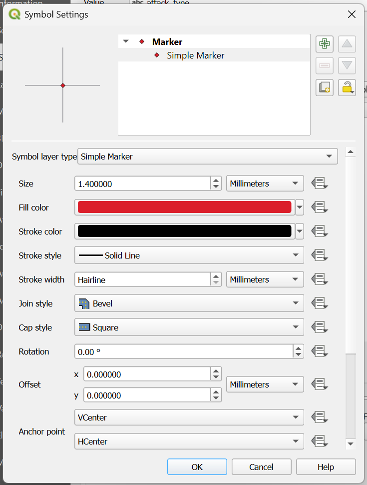
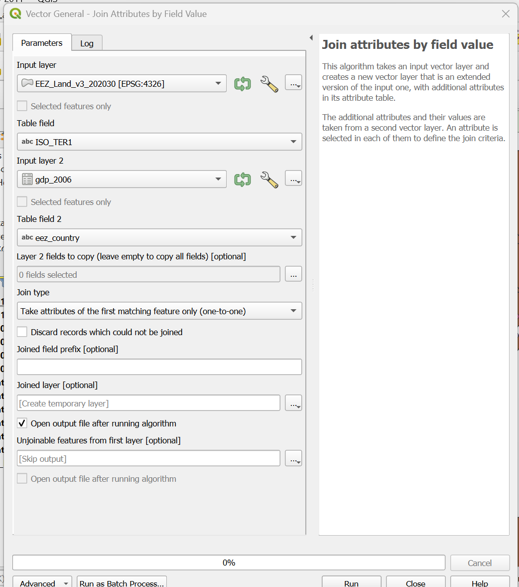

# ReMa-DH-TEAM3

## Project Overview
Previous research has indicated that from a global perspective, succesful pirate attacks are more likely to happen in regions that are relatively poor, have a fragile economy, and have decreasing military expenditure ([Okeahalam & Otwombe, 2016](https://link.springer.com/article/10.1007/s12198-016-0171-4)). In a review of existing prediction models, [Daxecker and Prins (2012)](https://dare.uva.nl/id/7cfda064-0786-4fe7-bf07-49fdcf70ee83) in addition found that geographic factors such as coastline length, population size, regional trade and peace years influenced the occurrence of pirate attacks, though predictore varied in significance between hijacking and other piracy incidents. This project investigates maritime piracy attack patterns during two significant surge periods, 1998–2003 and 2006–2011, as identified by [Rivas Pardo (2021)](https://revistas.umng.edu.co/index.php/ries/article/view/5282), using [Benden et al.](https://openhumanitiesdata.metajnl.com/articles/10.5334/johd.39)’s Global Database of Maritime Pirate attacks (2021). 
This project aims to build in particular on work done by [Daxecker and Prins (2012)](https://dare.uva.nl/id/7cfda064-0786-4fe7-bf07-49fdcf70ee83), who found that GDP showed a statistically significant correlation with piracy incidents, and [Rivas Pardo (2021)](https://revistas.umng.edu.co/index.php/ries/article/view/5282), who identified the two main ‘surge periods’ in the amounts of pirate attacks per year. It does this by asking whether there is a significant difference between the GDP levels of the countries where three different types of pirate attacks identified in the database of the International Maritime Bureau (IMB), namely the ‘attempted’, ‘boarded’, and ‘hijacked’ categories, tend to occur during both of the surge periods identified by [Rivas Pardo (2021)](https://revistas.umng.edu.co/index.php/ries/article/view/5282). This project takes a descriptive and exploratory approach, where GDP is not treated as a causal predictor of attack types: rather, it aims to observe whether the three attack types cluster around systematically higher or lower national GDPs compared to one another and whether this association shifts between the two surge periods. To support this analysis, QGIS is employed to spatially visualize the distribution of attack types alongside GDP levels across the affected countries, allowing geographic patterns to be examined alongside the economic ones.

## Data Acquisition
The dataset by [Benden et al. (2021)](https://openhumanitiesdata.metajnl.com/articles/10.5334/johd.39) included piracy attack events, along with their descriptive information. The attacks dataset includes:
- **Date** - Date of Attack. Used as a key with the Country Matrix data frame.
- **Time** - Time the attack took place, either in UTC or Local Time.
- **Longitude** - Longitude where the attack took place.
- **Latitude** - Latitude where the attack took place.
- **Attack Type** - Either NA (Missing), Attempted, Boarding, or Hijacked.
- **Location Description** - A text description of the location. With attacks taking place at sea, it is not as simple as just naming a city or town.
- **Nearest Country** - The country code whose shore is closest to the attack. The resolution is around 1 km, it can be much better depending on how detailed the mapping of the coast is in the vicinity.
- **EEZ Country** - The ISO 3166 country code of the country associated with the Exclusive Economic Zone (EEZ) in which the attack took place, if it took place within an EEZ.
- **Shore Distance** - Distance in kilometres to the shore from the attack location. This is the true geographic distance over the surface of the earth.
- **Shore Longitude** - The longitude of the closest point on the shore to the attack.
- **Shore Latitude** - The latitude of the closest point on the shore to the attack.
- **Attack Description** - The text description of the attack if it exists.
- **Vessel Name** - The name of the ship which was attacked if it is known.
- **Vessel Type** - The type of vessel attacked if known.
- **Vessel Status** - The status of the ship at the time it was attacked. Either NA (Missing), Berthed (Tied to a berth), Anchored (anchored at sea or in a harbour), or Steaming (ship underway).

To complement the dataset, additional information was added, accounting for a variety of different socioeconomic indicators from 1993 to 2020 for many countries. This part of the dataset includes:

- **Country** - The country in ISO 3166 country code format.
- **Corruption Index** - Corruption Perceptions Index.
- **Homicide Rate** - Total Intentional Homicides per 100,000 people.
- **GPD** - Gross Domestic Product (US Dollars).
- **Total Fisheries Per Ton** - Total Fisheries Production (metric tons).
- **Total Military** - Total Number of Armed Forces personnel.
- **Population** - Country Population.
- **Unemployment Rate** - Percentage of the Country Unemployed.
- **Total GR** - Total Government Revenue. An indication of how well the country collects taxes.
- **Industry** - Industrial contribution to total GDP.

Lastly, the dataset presents a three-letter ISO 3166 country code corresponding to the countries’ English names and the region the country is in.

Since the research question revolved around investigating attack types’ association with GDP in two specific time periods, we first (manually) divided the entire dataset (both attacks and indicators datasets) into the two pertinent time slots, 1998-2003 and 2006-2011. 
In the management of the data, two paths were taken: one for statistical analysis, using Python, and one for data visualization through mapping, using QGIS. 

### **Python path**

After dividing, we checked for missing data for the relevant variables in python.
**Date** entries were all present.  
**EEZ country** entries that were empty were cut.  
**Attack type** entries that were empty were cut, since there was no way to retrieve unambiguously the attack type from the description of the attacks.  
**GDP** information that was not present was filled in for the states that were involved in piracy attacks, when GDP information was available in trusted sources (e.g. Data World Bank or IMF).  
The original indicators dataset presented multiple duplicate lines, so these were also removed during preprocessing.  
Since the dataset presented naming inconsistencies for ‘boarded’ and ‘boarding’ attacks and the difference between them was not accounted for by the International Maritime Bureau (ICC-IMB Piracy and Armed Robbery Against Ships Report, 2023), we collapsed the two categories into one, named ‘boarded'.   
After preprocessing, the dataset presented 2068 observations for the 1998-2003 time slot and 1830 for the 2006-2011 time slots.  
Then, to proceed towards statistical analysis without too many troubles, the dataset of pirates attacks and socioeconomic indicators were merged into one, keeping only Year, EEZ Country, Attack Type and GDP per country per year.
The decision-making process behind these preprocessing steps will be described more in-depth in the Workflow Steps section.

### **QGIS path**
**GDP/EEZs**
In order to be able to map GDP changes year by year, we created using python single-year datasets, which included the relevant year, the ISO 3166-code for each country and its Exclusive Economic Zone, and the GDP for each country. The ‘Union of the ESRI Country shapefile and the Exclusive Economic Zones (version 3)’ shapefile from the Flanders Marine Institute [(Flanders Marine Institute, 2020)](https://www.vliz.be/en/imis?dasid=6406&doiid=403) was used to visualize the Exclusive Economic Zones (EEZs) and territories of each country. This shapefile was combined with the yearly GDP data, so that the GDPs could be visualized per year on a graduated map and the pirate attacks per year plotted on top of this. Though a more recent version was available, the choice was made to use the version that was used in constructing the original data set, to ensure the data were the same. The yearly GDP files and the EEZ shapefile were joined and cleaned in QGIS as follows:

1. In the Processing Toolbox, find ‘join attributes by field value’ (Vector General);
2. As input layer, set the EEZ shapefile. As input layer 2, set the GDP table (.csv). Set table fields to the columns that refer to the ISO codes for the countries in each layer (in the EEZ shapefile, we used ISO_ter1 as ISO_ter2 and ISO_ter3 were only filled in in case multiple countries claimed or governed a particular territory);

  

4. Make the resulting layer permanent in the layer overview, save it as GDP [year];
5. Open the attribute table of the resulting shapefile, sort by GDP so that all the *NULL* values come to the top of the table, then toggle editing, select all the entries with *NULL* values, and save the table. This creates a shapefile that includes only EEZs for countries with associated GDP data.

The *NULL* values were deleted, so that QGIS would not automatically include a 0-0 category for countries we had no data for in its symbology, and it would be visible which countries had no GDP data.

**Pirate attacks**
In order to prepare the pirate attacks data for use in QGIS, the original data set was split into twelve segments using the filter option in Google Sheets that only showed the pirate attacks for each of the years we wanted to consider.

## **Methodology**

### Python (Giulia)
Programming language Python was used to carry out dataset preprocessing and initial visualizations. After preparing the dataset, the normality of the data was assessed, revealing that neither piracy incident counts nor GDP values were normally distributed, which is an assumption required for parametric testing. Consequently, a Kruskal-Wallis test was performed, a test that evaluates whether three or more independent groups differ significantly from one another when associated with another variable: in this case, we wanted to check whether the three attack types were associated with significantly different GDP values. This test was applied separately for both surge periods. The Kruskal-Wallis test produces two outputs: an H score and a p-value. The H score reflects the degree of difference between the rank distributions of the groups, and higher values indicate greater divergence. The p-value then indicates whether this divergence is statistically significant: a p-value below the conventional threshold of 0.05 leads to the rejection of the null hypothesis (H0: all three attack types are drawn from the same GDP distribution), suggesting that at least one group differs meaningfully from the others. To determine the direction of these differences, more precisely which attack type is associated with higher or lower GDP values, the medians, the mean ranks and the interquartile range of each group must be examined.  
Where the Kruskal-Wallis test returned a significant result, indicating that at least one group differed from the others, a post-hoc Dunn test was conducted to identify which specific pairs of attack types were different. This additional test was necessary because the Kruskal-Wallis test only confirms that a significant difference exists somewhere among the groups, without specifying where. The Dunn test addresses this issue by performing pairwise comparisons between each combination of attack types (attempted vs boarded, attempted vs hijacked and boarded vs hijacked).  
In this analysis, GDP is treated as the dependent variable: rather than considering GDP as a cause or predictor of attack type, the goal is to observe whether the three categories of attacks (attempted, boarded, hijacked) are distributed across countries with meaningfully different economic indicators. In other words, the question is not whether a country’s wealth determines how it is attacked, but whether certain attack types tend to concentrate in wealthier or poorer economic environments. This approach deliberately excludes claims of causality or correlation. The main reason behind this decision is that GDP may be one of the factors influencing the type of piracy attack that occurrs in a given area, but it may not be the only one, since other geographical, political, institutional and demographic conditions may also play a relevant role. Considering only GDP as a cause of different attack types would risk oversimplifying a phenomenon that is multidimensional.  

### **QGIS (Jelmer)**
QGIS was used throughout the project to make sense of the data visually, and to pick out inconsistencies that were hard to identify from looking at the tables. Additionally, it was used to create maps that showed the changes in GDP per EEZ over the years, while plotting the different types of pirate attacks on top of these layers for both of the periods that were studied.  

### **Github (Eveline)**
In GitHub, we documented the research process, so that our steps could be retraced and reproduced by other researchers in the future.  

## **Workflow steps**

### **Initial data exploration**
The first moves we made were to understand the structure of the dataset of piracy attacks. The entire pirate attack data set was plotted in QGIS on top of the OpenStreetMap layer to observe the overall geographical distribution. This layer was combined with the file displaying the EEZs from the Flanders Marine Institute in such a way that QGIS could count the number of occurrences in each EEZ, in order to create a graduated map of piracy incidents globally for the entire timespan of the data set. This was done through the following steps.  

First, the CSV file containing all pirate attacks was loaded into QGIS as point coordinates, so that the the CRS for the project was set accurately (this was EPSG:4326 - WGS 84). Afterwards, the shapefile from the Flanders Marine Institute containing the EEZs was added. Then, using the vector analysis tool ‘count points in polygon’, the amount of attacks in each polygon was counted, so that a graduated map of the total amount of pirate attacks per EEZ for the entire timespan captured by the data set could be created.  

On top of this, the pirate attack point data was displayed, but with a graduated fill that distinguished between attack types, so that a rough overview was created of what regions saw the highest amounts of pirate attacks, but zooming in one could distinguish between the types of attack in each region. This was complemented by an analysis in Python, using graphs to better understand the distribution of attacks both over time and across space.  

### **Variable choices and preprocessing decisions**
1) **Time period selection**  
Following the approach of [Rivas Pardo (2021)](https://revistas.umng.edu.co/index.php/ries/article/view/5282), the analysis was restricted to two surge periods: 1998-2003 and 2006-2011. These intervals were selected for two reasons: first, they correspond to periods of significant increase in overall piracy activity as documented in the existing literature and confirmed by our own preliminary observation of the data; second, they offer an opportunity to complement Rivas Pardo’s findings, which document attack types but do not systematically investigate them. His study also reveals a geographical shift in attack locations between the two periods, from Southeast Asia to Africa, suggesting that the surge of Somali piracy meaningfully affected the overall piracy landscape. Building on this, we found it interesting to examine whether the economic environments associated with different attack types shifted accordingly.

2) **Geographical reference: EEZ country**  
Since the focus of this project is on the economic context of piracy attacks, we decided to use the geographical location of the attacks based on the Exclusive Economic Zone (EEZ) in which it occurred, rather than the nearest country by coastline, offered also by the dataset. EEZs are maritime areas, extending about 200 nautical miles beyond a country’s coastline within which a country has sovereign rights over both living and non-living maritime resources [(NOAA Ocean Exploration, 2023)](https://oceanexplorer.noaa.gov/ocean-fact/useez/). EEZs, for this reason, are to be considered an extension of the country’s economic space, making it the most appropriate geographical reference for linking attacks to GDP.  
During preprocessing, empty EEZ country entries were cut. This decision was guided by QGIS visualisation, which allowed us to understand the nature of the missing data. Approximately 17 attacks near the Comoros Islands were identified during this process, however, since GDP data for the Comoros was unavailable, these attacks were excluded during preprocessing, thus from the statistical analysis. Most of the missing EEZ country entries were identified as falling outside any EEZ, and therefore they could not be linked to a national GDP figure. Attacks that happened in maritime areas that were disputed territorial claims, where multiple countries claim jurisdiction (which was highlighted in the table of the EEZ file), were similarly set aside, given their institutional ambiguity.
One further geographical selection was considered in the initial steps of this project: together with an overall analysis, we wanted to carry out a focused analysis of attacks occurring near major maritime chokepoints, as [Daxecker and Prins (2012)](https://dare.uva.nl/id/7cfda064-0786-4fe7-bf07-49fdcf70ee83) had pointed out that this was an avenue that warranted further research, and Coggins (2012) also suggested proximity to chokepoints might be advantageous for pirates. Therefore, the chokepoints referenced in [Coggins (2012)](https://academic.oup.com/jpr/article-abstract/49/4/605/8365820?redirectedFrom=fulltext) were added to the QGIS exploration file, in order to assess whether there were any immediately visible patterns that might be interesting to analyze. This was done in the following way:
First, a shapefile containing ports was needed. For this, we downloaded the World Port Index (Pub 150) shapefile (National Geospatial-Intelligence Agency, 2017). Then, we identified the ports associated with the chokepoints in Coggin’s data from their codebook, which was published along with their revised data set in 2018 and is accessible through the following link: https://www.prio.org/journals/jpr/replicationdata. Subsequently, each of these ports was isolated from the World Port Index shapefile using the following expression in the ‘select by expression’ tool in QGIS:  
"PORT_NAME" =  'AS SUWAYS' OR  "PORT_NAME"  =  'BALBOA' OR  "PORT_NAME"  =  'ISTANBUL' OR  "PORT_NAME"  =  'BANDAR ABBAS' OR "PORT_NAME"  =  'AL MUKHA' OR  "PORT_NAME"  =  'MELAKA'.

Afterwards, we exported the selected features into a new shapefile containing just these six ports, and added these on top of the layers in the shapefile showing the concentration of pirate attacks in each EEZ.

However, this approach was later abandoned for two reasons. First, applying both a time and a geographical filter would have reduced the dataset too significantly, limiting the robustness of the statistical analysis. Second, maritime chokepoints are often considered disputed waters and they are not consistently defined in existing literature. This meant that any selection of confining states would have been an arbitrary decision of the group, weakly supported by existing literature. 

3) **Attack types and categorization**
The original attacks dataset presented seven different attack types (boarding, boarded, attempted, hijacked, explosion, fired upon, detained). Since not all of them were explicitly defined by IMB in their annual report [(ICC-IMB Piracy and Armed Robbery Against Ships Report, 2023)](https://www.icc-ccs.org/reports/2023_Annual_IMB_Piracy_and_Armed_Robbery_Report_live.pdf ), we decided to focus on the three types that were both explicitly defined and presented enough observations: attempted, boarded and hijacked. In QGIS, we used the ‘select by expression’ tool to select each category in turn, so that we could see the total number of selected items for each category, finding the following distribution:  

Attempted: 1796  
Boarded: 3399  
Boarding: 1364  
Hijacked: 466  
Detained: 1  
Explosion: 3  
Fired upon: 69  
Suspicious: 15  
NA: 119  

As the category of ‘boarded’ was significantly larger than that of ‘boarding’, and the ‘boarding’ category was not explicitly defined by the IMB, we decided to cut this category. Later, however, when we had separated the pirate attack files by year and loaded them into QGIS individually, we found that the ‘boarded’ and ‘boarding’ categories were alternated per year. Since we could not find any motivation behind alternating these categories, we decided to take into account the observations labeled ‘boarding’ after all and collapse them into a single category, labeled ‘boarded’, together with the observations already labeled ‘boarded’.  

4) **Socioeconomic variable: GDP**
Initially, we considered the use of a combination of socioeconomic indicators. However, this was ultimately abandoned as it would have exceeded both the statistical expertise of the group and the scope of this project. Handling and correctly interpreting the results of a multi-variable analysis requires a level of expertise with both statistical methods and the piracy topic that we could not offer. For this reason, the analysis was narrowed down to a single variable (GDP), which allowed for a more manageable approach.
Since we were considering only one socioeconomic variable, we had to make sure all piracy attacks had a corresponding GDP for the country they happened in, in that specific year. For this reason, we decided to fill in the GDP information that was not present for the states that were involved in piracy attacks, if this information was publicly available. Specifically:
- MMR (Myanmar) was missing 1998 and 1999;  
- SOM (Somalia) was missing 1998-2003 and 2006-2011;  
- STP (Sao Tome and Princip) was missing 1998, 1999, 2000;  
- IRQ (Iraq) was missing 1998-2003;  
- LBR (Liberia) was missing 1998 and 1999.

The GDP information for the mentioned states was taken from Data World Bank [(World Bank Open Data, 2026)](https://data.worldbank.org/indicator/NY.GDP.PCAP.CD), a source used also in the original dataset. One country (TWN, Taiwan) was missing entirely from the socioeconomic indicator dataset, but was present in the piracy attacks dataset, so it was added for both time slots 1998-2003 and 2006-2011, and the data was taken from the International Monetary Fund website [(International Monetary Fund, 2026)](https://data.imf.org/en). For three attacks in particular, it was not possible to retrieve GDP information regarding their EEZ country (GUF, French Guana, MTQ, Martinique, MYT, Mayotte), so these three cases were dropped.  

### **Handling GDP data**  
An initial approach considered averaging GDP and attack counts per country in the overall period, 1993-2020, with the intention of reducing the influence of outliers. The means were calculated using Excel and Python. However, this approach was abandoned because averaging over a 20-year period flattened the data too significantly, reducing both variability and potential statistical value.  

### **Statistical approach**  
Before selecting a statistical test, the normality of GDP values was assessed (using Shapiro-Wilk test). Neither period followed a normal distribution, forcing us to exclude the use of parametric testing, such as linear regression or t-tests, which require this assumption. A log-transformation of the GDP values was also attempted on both time slices to approximate normality, however this did not produce satisfactory results.  
Each group member independently researched statistical tests suitable for the nature of the data, which led to a debate regarding the analytical approach. One member proposed assessing correlation between GDP and attack type, while another argued in favor of assessing association, motivated by the fact that framing GDP as a predictor of attack type would’ve been reductive for a phenomenon shaped by many other factors. The latter position was ultimately adopted, as it better reflected the non-causal framing of the project. As a consequence of this debate and the non-normal distribution of the data, a non-parametric approach was adopted, leading to the selection of the Kruskal-Wallis test, followed by a Dunn test.  
To acquire familiarity with the tests, various sources were consulted by the group: https://www.geeksforgeeks.org/machine-learning/how-to-perform-dunns-test-in-python/, https://library.virginia.edu/data/articles/getting-started-with-the-kruskal-wallis-test, https://numiqo.com/tutorial/kruskal-wallis-test, https://statistics.laerd.com/spss-tutorials/kruskal-wallis-h-test-using-spss-statistics.php, https://statistics.laerd.com/spss-tutorials/kruskal-wallis-h-test-using-spss-statistics.php#procedure.  
These sources offered theoretical explanations as well as python implementations and guided us through the interpretation of the tests’ outputs.  
The Kruskal-Wallis test was implemented in Python using the scipy.stats.kruskal function with default settings [(UVA Library, 2021)](https://library.virginia.edu/data/articles/getting-started-with-the-kruskal-wallis-test). For the post-hoc Dunn test, the scikit_posthocs library was used, with the Bonferroni correction applied to adjust p-values [(GeeksforGeeks, 2025)](https://www.geeksforgeeks.org/machine-learning/how-to-perform-dunns-test-in-python/). This correction was chosen following the literature reported above.  

### **Creating the maps**  
The maps were through the following steps in a single QGIS project. First, the pirate attacks files were uploaded.  
1. Load the CSV files containing the pirate attacks per year into QGIS as point coordinates, so that they set the CRS for the rest of the files accurately (this should be EPSG:4326 - WGS 84);
2. Create a categorized symbology based on attack type, with symbology set as follows, with ‘hijacked’ red, ‘boarded’/’boarding’ as light orange, and ‘attempted’ as green:
  

3. Uncheck any categories except ‘boarded’, ‘boarding’, ‘attempted’, and ‘hijacked’;
4. Repeat this process for all years.

Then, the GDP and EEZ information was addedGDP/EEZs:  
1. Load the EEZ shapefile;
2. Load the CSV files containing the GDP data per year with no geometry;
3. In the Processing Toolbox, find ‘join attributes by field value’ (Vector General);
4. As input layer, set the EEZ shapefile. As input layer 2, set the GDP table. Set table fields to the columns that refer to the ISO codes for the countries in each layer (in the EEZ shapefile, we used ISO_ter1 as ISO_ter2 and ISO_ter3 were only filled in in case multiple countries claimed or governed a particular territory)

  

5. Make the resulting layer permanent in the layer overview, save it as GDP [year];
6. Open the attribute table of the resulting shapefile, sort by GDP so that all the *NULL* values come to the top of the table, then toggle editing, select all the entries with *NULL* values, and save the table. This creates a shapefile that includes only EEZs for countries that we have GDP data for;
7. Create a graduated fill for GDP with five classes, set to Equal Count (Quantile);
8. Repeat this for all GDP attribute tables to create shapefiles of the EEZs that link our GDP data to the right countries.

### **Challenges and solutions**  
One of the primary challenges encountered during the project was the presence of missing or inconsistent data. Several attacks lacked EEZ country ISO3 codes, despite having valid coordinates and GDP data was absent for a number of countries involved in the piracy attacks, even when such data was available on the Internet. The former was addressed through manual verification in QGIS, which allowed us to identify the correct EEZ for several cases and make informed decisions about data exclusions. The latter was resolved by sourcing for the missing GDP data from Data World Bank and the International Monetary Fund, consistent with the sources used in the original dataset.  
A further challenge was the inconsistent naming of attack types in the dataset, specifically the alternation between ‘boarded’ and ‘boarding’ with no distinction accounted for by the IMB annual reports. This was resolved by manually inspecting some of the classifications, to finally come to the decision of collapsing the two categories into one.  
The non-normal distribution of the data presented a methodological challenge, since we had to reach for non-parametric testing, which was something we were only vaguely familiar with. This issue was addressed by having each member independently research statistical tests suitable for non-normally distributed data. After debating and selecting the tests, each member tried to get acquainted with their theoretical foundations using various sources (cited in the Methodology section). Lastly, the group encountered disagreement regarding the appropriate framing of the research question and its objectives and specifically whether to assess correlation or association between GDP and attack type. This was resolved through a group discussion, ultimately leading to the adoption of an exploratory approach with a non-causal framing.  
Challenging was also the lack of experience with some of the tools used. It took a considerable amount of time to understand how to achieve some of our ends through QGIS or even Google Sheets (such as splitting the table through the Filter option). In QGIS, a lot of trial and error was involved in finding the best ways to visualize the data and to combine the layers, and steps were retraced several times. In addition, the fact that different group members had experience in using different tools was difficult, as this sometimes made it harder to communicate about what we needed from one another. Over time, this became easier, as we started understanding what the others were able and unable to do.  
The same went for the lacking background in conducting research using statistics among all group members: it took a lot of time to work out how to conduct this part of the research, and we were often faced with the consequences of ‘not knowing what one does not know’: often when we thought we understood, it turned out that we had misinterpreted something or missed a step, leading to lots of extra work being needed at unexpected points in the research and making it difficult to properly plan and estimate the amount of time still needed to complete the project. As this happened a few times nearing the end of the project, the way this was solved was by staying in close contact about what we were each working on and planning several extra online meetings to talk through the problems we were encountering and the gaps in our knowledge, to ensure we could arrive at a similar level of understanding and still produce results.  

### **Ethical considerations**  
The data used in this project is publicly available and does not contain any personally identifiable information. The piracy attack dataset by [Benden et al. (2021)](https://openhumanitiesdata.metajnl.com/articles/10.5334/johd.39) records incident-level data without identifying any individual involved, victims or criminals. Only the incident locations, involving descriptions and coordinates, that are given and sometimes the names and types of the vessels could lead to some sort of identification. GDP and other socioeconomic indicators are collected at country level and were sourced from established international institutions (International Maritime Bureau, Data World Bank, International Monetary Fund), presenting no privacy issues. We are aware that even when this data is publicly available through organizations such as the IMB, ethical handling is necessary to avoid exposing vulnerable vessels, harbors or personnel.  
One potential concern for bias could be that not all piracy attacks may be reported to the IMB, therefore reporting rates may vary across regions and time periods. This possible reporting bias can arise if incidents are more likely to be documented because of stronger monitoring systems or international shipping traffic. This means that the original dataset may not entirely capture the real extent of piracy activity. Our project necessarily inherits this bias. The decisions made during preprocessing regarding which attacks to include or exclude may be considered a form of selection bias. Attacks occurring outside any EEZ, in disputed waters, or in countries with missing GDP data were removed from the analysis consciously. Since these attacks were excluded, it is not possible to rule out that they may have had an impact on the project’s results. The team has attempted to soften this selection bias by documenting all exclusion decisions transparently.  

## **Results**  

### **Period 1: 1998-2003**  
The boxplot for the 1998-2003 period shows that the GDP distribution of the three attack types are broadly similar, with a large number of outliers across all three groups. The majority of observations cluster at low GDP values, suggesting that most attacks across all types occurred in economically poor contexts. Hijacked attacks display a visibly wider box compared to the other two types, hinting at some difference between the upper end of the distribution.  

  

The Kruskal-Wallis test returned an H-statistics of 7.32 and p-value of 0.026, which falls below the 0.05 threshold, leading to the rejection of the null hypothesis (H0: all three attack types are drawn from the same GDP distribution). This indicates that at least one attack type is associated with a significantly different GDP distribution. Examining the mean ranks, hijacked attacks show the highest mean rank (1185.39), followed by attempted (1046.18) and boarded (1019.97), suggesting that hijackings tended to occur in countries with relatively higher GDP compared to the other two types. This is reflected also in the median, where hijacked (929.78) is higher than both attempted (780.19) and boarded (780.19), which are identical.  

## Kruskal-Wallis Test for Period 1 (1998-2003)
**H-statistic:** 7.3220 | **P-value:** 0.0257

| Attack Type | Raw Count | Mean GDP | Min GDP | 1Q | Median | 3Q | Max GDP | Mean Rank |
|-------------|-----------|----------|---------|--------|--------|---------|---------|-----------|
| Attempted | 528 | 1474.15 | 137.17 | 550.36 | 780.19 | 1072.81 | 23447.03 | 1046.18 |
| Boarded | 1442 | 1580.58 | 102.60 | 463.95 | 780.19 | 1342.49 | 39496.49 | 1019.97 |
| Hijacked | 98 | 2424.39 | 190.67 | 464.75 | 929.78 | 3808.24 | 23852.33 | 1185.39 |  

The post-hoc Dunn test reveals that the only statistically significant pairwise difference is between boarded and hijacked attacks (p = 0.024), while the difference between attempted and hijacked does not reach significance (p = 0.102). No significant difference was found between attempted and boarded attacks (p = 1.00).  

## Dunn Post-hoc Test for Period 1 (1998-2003)

|           | Attempted | Boarded | Hijacked |
|-----------|-----------|---------|----------|
| Attempted | 1.0000    | 1.0000  | 0.1018   |
| Boarded   | 1.0000    | 1.0000  | 0.0238   |
| Hijacked  | 0.1018    | 0.0238  | 1.0000   |  

  

### **Period 2: 2006-2011**
The boxplot for this second period (2006-2011) shows a similar overall pattern of distributions, with numerous outliers. GDP values are generally higher across all three groups compared to the first period, signaling a world-wide increase of GDP per capita. Boarded attacks display a notably wider box, while hijacked and attempted attacks appear more compressed toward lower GDP values. 

  

The Kruskal-Wallis test returned a considerably stronger result, with an H-statistics of 50.75 and a p-value of 9.54e-12, indicating a highly significant difference in GDP distributions across attack types. Examining the mean ranks, boarded attacks show the highest mean rank (997.50), followed by attempted (826.33) and hijacked (804.80). This suggests that during this period, boarded attacks tended to occur in countries with relatively higher GDP, while hijackings and attempted attacks were more concentrated in lower GDP contexts. The medians also reflect this: boarded attacks have the highest median GDP (1891.34), compared to attempted (1334.78) and hijacked (1229.25). 

## Kruskal-Wallis Test for Period 2 (2006-2011)

**H-statistic:** 50.7504 | **P-value:** 9.54e-12

| Attack Type | Count | Mean GDP | Min GDP | 1Q | Median | 3Q | Max GDP | Mean Rank |
|-------------|-------|----------|---------|---------|---------|---------|---------|-----------|
| Attempted | 665 | 3218.95 | 219.2 | 1116.08 | 1334.78 | 2242.87 | 51733.44 | 826.33 |
| Boarded | 977 | 3216.66 | 235.3 | 1101.96 | 1891.34 | 3643.04 | 53890.43 | 997.50 |
| Hijacked | 188 | 3844.54 | 219.2 | 951.69 | 1229.25 | 2520.40 | 53890.43 | 804.80 |  

The post-hoc Dunn test identifies two significant pairwise differences: between attempted and boarded attacks (p = 3.45e-10) and between boarded and hijacked attacks (p = 1.39e-05). No significant difference was found between attempted and hijacked attacks (p = 1.00). 

## Dunn Post-hoc Test for Period 2 (2006-2011)

|           | Attempted | Boarded   | Hijacked  |
|-----------|-----------|-----------|-----------|
| Attempted | 1.00e+00  | 3.45e-10  | 1.00e+00  |
| Boarded   | 3.45e-10  | 1.00e+00  | 1.39e-05  |
| Hijacked  | 1.00e+00  | 1.39e-05  | 1.00e+00  |  

  

## **Connection to the research question**  
RQ: Is there a significant difference between the GDP levels of the countries where three different types of pirate attacks (‘attempted’, ‘boarded’, and ‘hijacked’) tend to occur during both surge periods (1998-2003, 2006-2011)?  
Our findings suggest that different attack types were indeed associated with different GDP levels across both surge periods, though the nature of this association shifted between the two intervals. In 1998-2003, hijackings were recorded as occurring in relatively higher-GDP countries compared to boarded attacks. In 2006-2011, this pattern reversed, with boarded attacks associated with higher GDP contexts and hijacking clustering towards lower GDP environments. It is also important to note that despite these differences, on a global scale all of the categories of pirate attacks still tend to happen in countries with a relatively low GDP.  

## **Documentation and Sustainability**  
The Python code used for data preprocessing, statistical analysis and visualization is organized and published to allow for reproducibility. The preprocessing steps, variable choices and statistical decisions are documented in detail in the Methodology and Workflow Step sections, so that the analysis can be replicated or extended by future researchers.  
The outputs of this project, including the preprocessed datasets for both surge periods, the Jupiter Notebooks and the QGIS files are stored in the present Github repository. These files can be accessed to reproduce the full analysis by following the steps documented in this page. In terms of reusability, the preprocessed datasets for both time periods (indicators1998-2003 and indicators2006-2011) can be reused directly. Similarly, the Jupiter Notebooks are ordered and modular and may be adapted to a certain extent for different variables, time periods or other subsets of the data. The QGIS materials are also available for reuse: these include pirate attacks per year CSV files and GDP per year CSV files, acknowledging that these still contain the NULL values, as preprocessing was done after importing the files into QGIS. 

## **Reflection**

### QGIS
Pirate attacks
1. Load all the pirate attacks per year .CSV files into QGIS as point coordinates, so that they set the CRS for the rest of the files accurately (this should be EPSG:4326 - WGS 84)
2. create a categorized symbology based on attack type, with symbology set as follows:
   
with ‘hijacked’ red, ‘boarded’/’boarding’ as light orange, and ‘attempted’ as green.
3. Ucheck any categories except ‘boarded’, ‘boarding’, ‘attempted’, and ‘hijacked’
4. Repeat this process for all years

GDP/EEZs
1. Load in the EEZ shapefile
2. Load in the GDP .CSV files for 2006-2011 with no geometry
3. In the Processing Toolbox, find ‘join attributes by field value’ (Vector General)
4. As input layer, set the EEZ shapefile. As input layer 2, set the GDP table. Set table fields to the columns that refer to the ISO codes for the countries in each layer (in the EEZ shapefile, we used ISO_ter1 as ISO_ter2 and ISO_ter3 were only filled in in case multiple countries claimed or governed a particular territory)
 
5. Make the resulting layer permanent in the layer overview, save it as GDP [year]
6. Open the attribute table of the resulting shapefile, sort by GDP so that all the NULL values come to the top of the table, then toggle editing, select all the 7. Entries with NULL values, and save the table. This creates a shapefile that includes only EEZs for countries that we have GDP data for
8. Create a graduated fill for GDP with five classes, set to Equal Count (Quantile)
9. Repeat this for all GDP attribute tables to create shapefiles of the EEZs that link our GDP data to the right countries

## Challenges and Solutions

One of the challenges we encountered while working on this project was the inconsistency of the use of the terms _boarding_ and _boarded_ in the original dataset. We first decided on 

## Ethical Considerations

## Results

## Documentation and Sustainability

## Reflection

### Meeting 1: 27th of April

### Meeting 2: 1st of May

### Meeting 3: 4th of May

### Meeting 4: 12th of May
Decisions made - We are going to look into the following time-periods: 1998-2003 & 2006-2011

## Authors
G. Massaggia, J. Groenenboom and E.J. Miedema.

## Acknowledgements
This data set would not have been possible without the work of [International Maritime Bureau (IMB)](https://icc-ccs.org/), [Professor Brandon C. Prins](https://brandonprins.weebly.com/index.html) and [Benden et al. (2021)](https://openhumanitiesdata.metajnl.com/articles/10.5334/johd.39).

## Competing Interests
The authors have no competing interests to declare.

## References
Benden, P., Feng, A., Howell, C., & Dalla Riva G. V. (2021). Crime at Sea: A Global Database of Maritime Pirate Attacks (1993–2020). Journal of Open Humanities Data, 7: 19, pp. 1–6. DOI: https://doi.org/10.5334/johd.39
